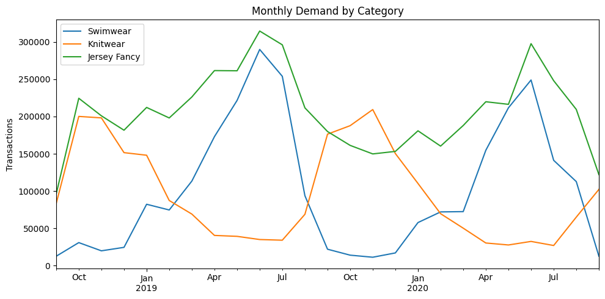
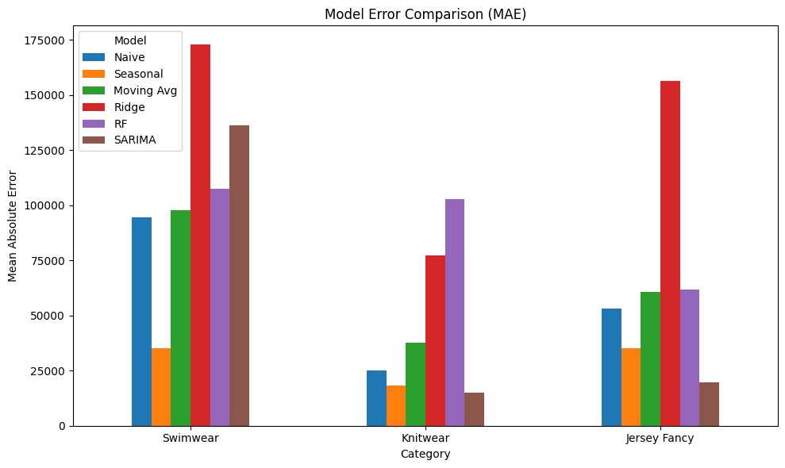
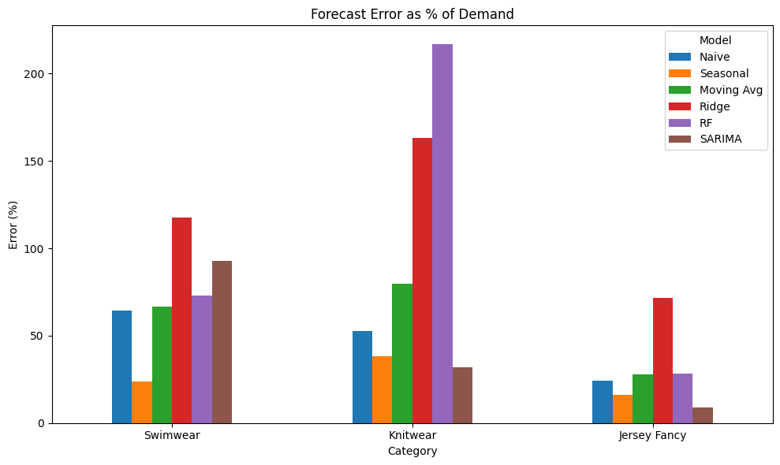
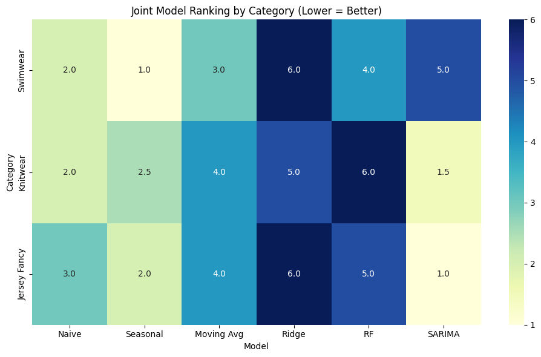
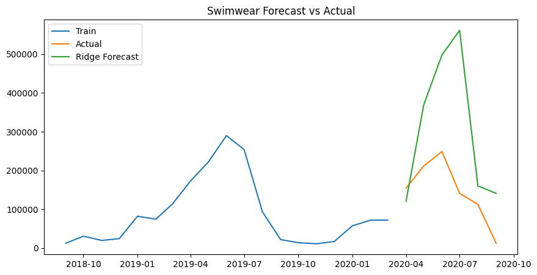
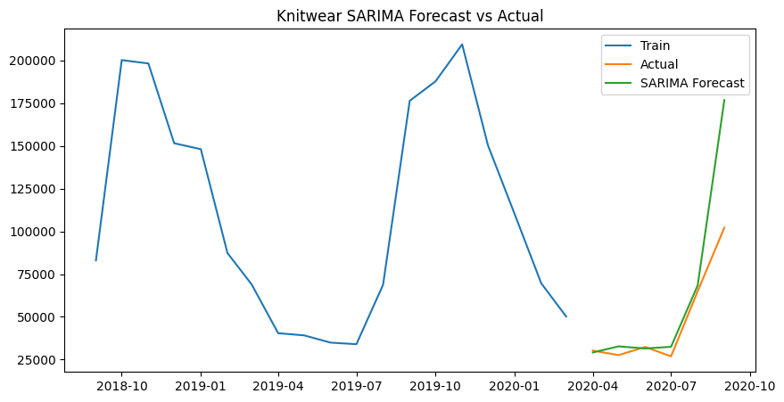
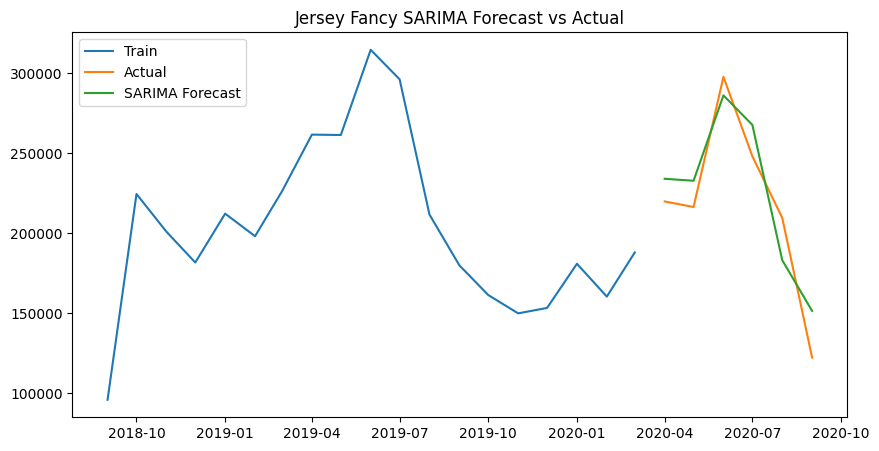

# Fashion Demand Forecasting: Seasonal Retail Model Benchmarking

## Table of Contents
- Executive Summary  
- Business Context  
- Modeling Framework  
- Data Description  
- Model Comparison  
- Visual Diagnostics  
- Deployment Recommendation  
- Limitations  
- Tech Stack  
- Skills Demonstrated  
- Why This Project Matters  
- How to Run  

---

## Executive Summary

This project evaluates forecasting approaches for monthly seasonal retail demand across three product categories:

- **Swimwear**
- **Knitwear**
- **Jersey Fancy**

The objective was to determine whether increasingly sophisticated models meaningfully improve forecast performance under limited historical depth.

### Key Findings

- Strong annual seasonality dominates demand patterns.
- Simple seasonal baselines remain highly competitive.
- Increased model complexity does not guarantee improved accuracy.
- Forecast error ranges from approximately **9% to 32% of average monthly demand**, depending on category volatility.

Overall, model performance is driven more by demand characteristics than algorithmic sophistication.

---

## Business Context

Accurate demand forecasting is critical for:

- Inventory allocation  
- Stockout reduction  
- Working capital optimization  
- Seasonal merchandising strategy  

This analysis benchmarks multiple forecasting approaches to determine which models provide the most reliable predictions across categories with differing volatility.

---

## Data Overview

The dataset is derived from the **H&M Personalized Fashion Recommendations** Kaggle competition.

Transaction-level data was aggregated to monthly unit demand by product category.

Time span: ~24 months  
Validation: Final months held out for forecast evaluation  

---

## Modeling Framework

Six forecasting approaches were evaluated:

| Model | Description |
|-------|-------------|
| **Naive** | Last observed value |
| **Seasonal Naive** | Same month last year |
| **Moving Average** | Rolling window smoothing |
| **Ridge Regression** | Linear model with lag features |
| **Random Forest** | Nonlinear ensemble method |
| **SARIMA** | Seasonal autoregressive integrated moving average |

Models were compared using:

- Mean Absolute Error (MAE)
- Root Mean Squared Error (RMSE)
- Joint MAE–RMSE ranking
- Error as a percentage of average demand

---

# Visual Diagnostics

## Seasonal Demand Patterns

Strong seasonality is visible across categories, particularly in Swimwear.

Seasonal peaks justify the use of seasonal baselines and time-series models.

---

# Model Comparison

## Model Error Comparison (MAE)

Absolute forecast error comparison across categories:

Key observation:
- Seasonal Naive performs competitively in volatile categories.
- Ridge and Random Forest show higher instability.
- SARIMA performs well in smoother categories.

---

## Forecast Error as Percentage of Demand

Normalizing error provides operational relevance.

Key insight:
- Swimwear error ≈ 24–65%
- Knitwear error ≈ 32–80%
- Jersey Fancy error ≈ 9–28%

Demand volatility strongly influences forecast reliability.

---

## Joint Model Ranking (MAE + RMSE)

A consolidated ranking across both MAE and RMSE:

Observations:

- **Swimwear:** Seasonal Naive ranks highest.
- **Knitwear:** SARIMA performs strongest.
- **Jersey Fancy:** SARIMA leads, with Seasonal close behind.

Model performance is category-dependent.

---

## Forecast Examples by Category

### Swimwear – Seasonal Naive

This example demonstrates the model’s ability to capture peak summer seasonality in highly volatile demand.

---

### Knitwear – SARIMA

SARIMA effectively captures smoother seasonal transitions in knitwear demand, reducing error relative to naive baselines.

---

### Jersey Fancy – SARIMA

For stable demand categories, SARIMA provides strong seasonal alignment and lower relative forecast error.

---

# Deployment Recommendation

Based on evaluation:

- Use **Seasonal Naive** as a benchmark for volatile categories.
- Deploy **SARIMA** for smoother seasonal series.
- Use Ridge regression when engineered external features are available.
- Avoid high-variance nonlinear models without sufficient historical depth.

Model selection should be tailored to category volatility rather than defaulting to the most complex algorithm.

---

# Limitations

- Limited historical depth (~24 months)
- No external regressors (pricing, promotions, weather)
- Single validation split

Future improvements could include feature enrichment and rolling cross-validation.

---

# Tech Stack

**Data Processing**
- pandas
- NumPy

**Forecasting Models**
- SARIMA (statsmodels)
- Prophet

**Visualization**
- matplotlib
- seaborn

**Programming**
- Python

---

# How to Run

1. Clone the repository  
2. Install required libraries
3. Download the [H&M Personalized Fashion Recommendations dataset](https://www.kaggle.com/competitions/h-and-m-personalized-fashion-recommendations) from Kaggle 
4. Place data in a `data/` directory  
5. Run `FashionDemandForecast.ipynb` from top to bottom  

---

# Author

**Johnathan Ryan Wu**  
UC Berkeley – Master of Analytics  
GitHub: https://github.com/johnathanryanwu-berk
